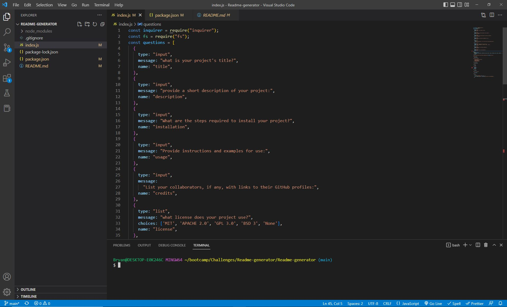

# README Generator


## Description

  Tool for creating professional README.md files for any project.

## Table of Contents
    
  - [Installation](#installation)
  - [Usage](#usage)
  - [Credits](#credits)
  - [License](#license)

## Installation

  N/A

## Usage
  Install inquirer with ```npm i```.
  Run the app by typing  ```node index``` into the CLI.
  Answer the following prompts in the CLI to create the README.

  Sometimes the license information will not update on the README preview, close and reopen vs code to solve the issue.

  

  Video Walk-through: https://drive.google.com/file/d/18He5rV6Fe1hxn7OMmm2_c1YeyH64KuRg/view
  
  Github: https://github.com/Bryandalton/Readme-generator

## Credits

  Bryan Dalton 
  
  

## License

  MIT
        
## How to contribute
    
  N/A
        
## Tests
        
  N/A